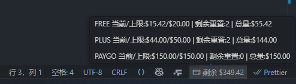

# VSCode 状态栏插件

[仓库](https://github.com/byebye-code/88code-status-vscode-extension)

[Marketplace](https://marketplace.visualstudio.com/items?itemName=eigeen.88code-status-vscode-extension)

## 安装

参考 VSCode 插件安装方法。可在插件市场搜索 `88code Status` 找到插件。

## 使用

会在右下角显示一个状态栏图标，显示当前最大剩余可用额度。鼠标悬浮在上方可查看详细信息。

