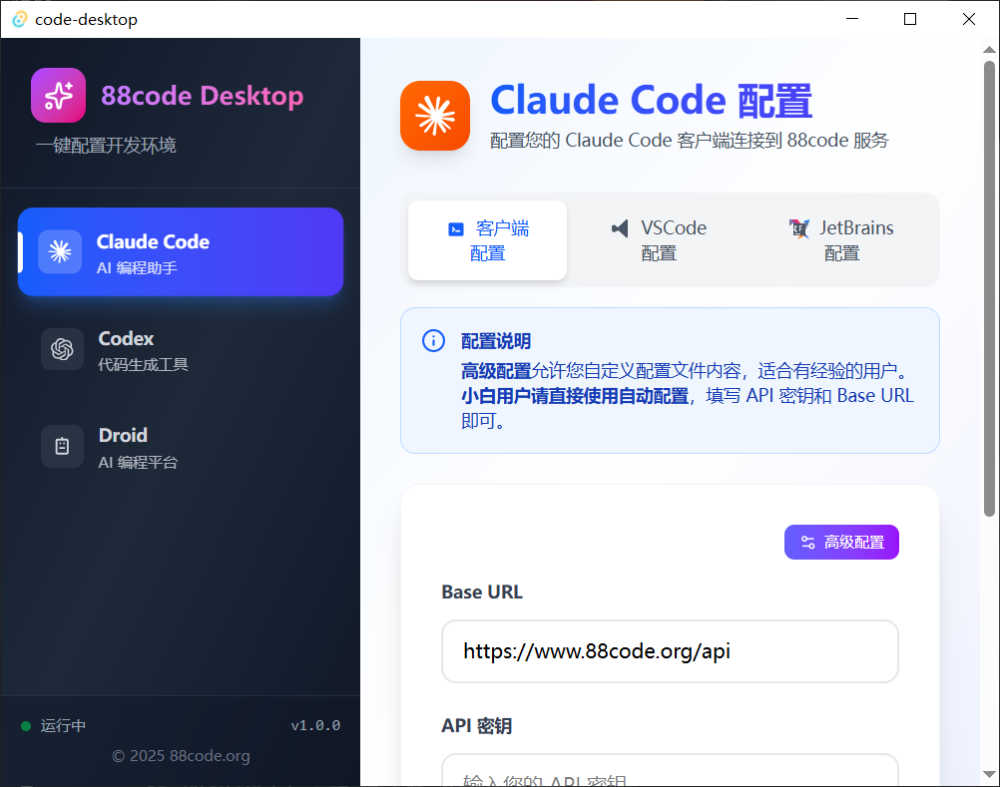

# 88code Desktop 环境自动配置工具 指南

## 1. 项目介绍

88code Desktop 是一款帮助开发者快速完成 AI 辅助开发工具配置的跨平台桌面应用。它专注于为 Claude Code、Codex、Droid 以及相关 VSCode 扩展提供一键式配置、备份与维护功能，避免手动修改多个配置文件带来的重复劳动与风险。

**核心价值**：通过自动配置完成 Base URL、API Key、环境变量及自定义模型设置，确保不同机器、不同操作系统下的配置结果一致且可追溯。
[自动配置工具地址](https://github.com/byebye-code/88code-desktop)

## 2. 技术与运行要求
可先尝试项目中release中以后的对应环境安装包，如果不可行，可尝试自己build。
直接运行已打包的桌面安装包时，无需以下开发环境；如果计划自行构建，请准备：

- **Node.js 18+**：建议使用官方安装包或 Node Version Manager（nvm）。安装后执行 `corepack enable` 以获取 pnpm。
- **Rust 工具链**：通过 `rustup` 安装最新稳定版 Rust，并确保已安装 `cargo`。
- **Tauri 平台依赖**：
  - Windows：Visual Studio Build Tools（包含 Desktop development with C++）
  - macOS：Xcode Command Line Tools，运行 `xcode-select --install`
  - Linux：GTK3、WebKit2GTK、OpenGL、openssl 等，参见 [Tauri 前置条件](https://tauri.app/v1/guides/getting-started/prerequisites)
- **包管理器**：pnpm ≥ 8 或 Bun ≥ 1.1（二选一即可）

## 3. 功能矩阵

默认推荐使用“自动配置”模式，仅需填入 API Key 即可完成配置；“高级配置”适合熟悉 JSON/TOML 的用户进行自定义。

| 模块 | 主要功能                               |
| --- |------------------------------------|
| Claude Code | 自动/高级配置，支持 Base URL、API Key 续写与备份  |
| Codex | 自动/高级配置写入环境变量和codex配置              |
| Droid | 自动/高级配置Droid，管理自定义模型列表             |
| VSCode 扩展 | 自动配置扩展所需文件                         |
| 配置备份 | 首次操作前生成备份文件；各配置同目录 `.bak` 防止覆盖原始配置 |


## 4. 开发与构建流程

### 4.1 安装基础环境

- **Node.js 18+**：前往 [nodejs.org](https://nodejs.org/) 下载 LTS 安装包并完成安装，或使用 nvm：
  ```bash
  # macOS/Linux
  curl -o- https://raw.githubusercontent.com/nvm-sh/nvm/v0.39.7/install.sh | bash
  nvm install 20
  nvm use 20
  ```
  安装完 Node 后执行 `corepack enable` 以启用官方包管理代理。
- **Rust Toolchain**：使用官方安装脚本或 MSI 安装器：
  ```bash
  # 所有平台通用脚本
  curl --proto '=https' --tlsv1.2 -sSf https://sh.rustup.rs | sh
  ```
  Windows 用户可下载 [rustup-init.exe](https://win.rustup.rs/)。完成后运行 `rustup update` 同步最新版本。
- **Tauri 依赖**：
  - 这段是ai给的，环境不行的话百度一下或者问一下ai。
  - Windows：安装 Visual Studio Build Tools，启用「Desktop development with C++」工作负载。
  - macOS：安装 Xcode Command Line Tools：`xcode-select --install`。
  - Linux：安装 GTK3、WebKit2GTK、OpenSSL 等依赖，参考发行版指令或 Tauri 文档。

### 4.2 安装包管理器

> pnpm 与 Bun 均可完成项目构建，选择其一即可。

- **pnpm**
  ```bash
  corepack enable
  corepack prepare pnpm@latest --activate
  pnpm --version
  ```
- **Bun**（推荐）
  ```powershell
  # Windows PowerShell
  irm https://bun.sh/install.ps1 | iex
  ```
  ```bash
  # macOS/Linux
  curl -fsSL https://bun.sh/install | bash
  ```
  重新打开终端后运行 `bun --version` 验证安装。

### 4.3 安装依赖

```bash
# 使用 pnpm
pnpm install

# 或使用 Bun
bun install
```

### 4.4 构建发行包
```bash
# 使用 pnpm
pnpm tauri build

# 或使用 Bun
bun run tauri build

```

构建输出位于 `dist/`（前端静态资源）与 `src-tauri/target/`（各平台二进制包）。

### 4.5 构建常见问题

- 更新 Rust Toolchain：`rustup update`
- Windows 缺少构建依赖：确认已安装 Visual Studio Build Tools 并重启终端
- macOS 缺少命令行工具：`xcode-select --install`
- Linux 构建失败：确认已安装 WebKit2GTK、GTK3、OpenSSL，必要时查阅发行版 Wiki

## 5. 应用使用指南

- **通用流程**：
 1. 启动 88code Desktop，选择左侧需要配置的模块。
 2. 填写 Base URL、API Key 或其他参数。
 3. 点击“自动配置”完成写入，或打开“高级配置”进行手动配置。
 4. 程序会在首次写入前创建备份，并在后续操作时保留已有字段。
 5. 查看右上角通知确认配置结果。

  - **Claude Code**：
    - 默认 Base URL `https://www.88code.org/api`
    - 写入 `~/.claude/settings.json`，保留原有自定义字段。
  - **Codex**：
    - 管理 `auth.json`（凭证）与 `config.toml`（服务配置）。
    - 自动设置 `key88=<密钥>` 为系统环境变量。
  - **Droid**：
    - 追加或更新 `custom_models` 列表，默认提供 88code 官方模型：
      - `Sonnet 4.5 [88code]`
      - `GPT-5-Codex [88code]`
      - `GPT-5 [88code]`

  - **VSCode 扩展**：
    - 自动识别 VSCode/Insiders/VSCodium 配置目录。
    - 为 Claude 与 Codex 扩展写入所需设置。

- **重启提示**：
  - Windows：配置环境变量后需重新打开终端。
  - macOS/Linux：执行 `source ~/.zshrc` 或重启终端。


## 6. 参考路径速查

- Claude Code：`~/.claude/settings.json`
- Codex：`~/.codex/auth.json`、`~/.codex/config.toml`
- Droid：`~/.droid/config.json`
- VSCode 配置：
  - Windows：`%APPDATA%/Code/User/settings.json`
  - macOS：`~/Library/Application Support/Code/User/settings.json`
  - Linux：`~/.config/Code/User/settings.json`

