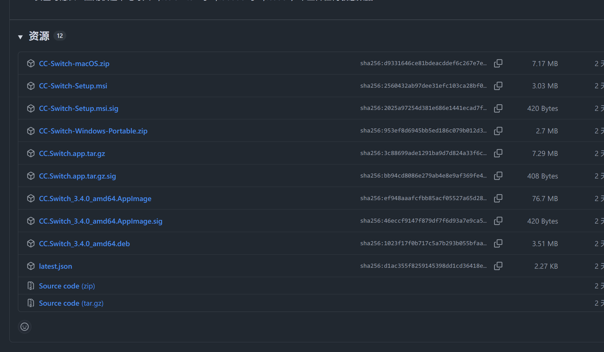

## CC SWITCH使用教程
##### 写作时间: 2025.10.04
大家好呀，国庆快乐!!! 
我是88code的狗管理--，我一直看到大家在群里反复反馈类似授权各种问题,有不少是没有配置好配置文件导致的的，想和大家分享一下CC SWITCH的使用方法。

### 首先介绍一下CC SWITCH是什么?
CC SWITCH是一个用于图形化的Claude Code和Codex多配置文件管理和切换的工具。
它可以帮助用户在不同的配置文件之间快速切换，方便进行多种编程任务。
而且不用再手动打开用户目录去翻配置文件然后打开编辑器编辑，CC SWITCH免除了这个痛苦
只需要在CC SWITCH中选择对应的配置文件即可。

缺点是目前只支持MAC windows 还有Linux这些有桌面环境的操作系统. 无GUI界面的操作系统如服务器和远程服务器等暂不支持.

GitHub repo: https://github.com/farion1231/cc-switch 在此🙏🙏🙏farion1231的付出!!

### 话不多说,我来教大家怎么使用CC SWITCH
1. 首先，确保你已经安装了CC SWITCH。可以在88code的下载页面找到它。
打开: https://github.com/farion1231/cc-switch/releases/latest 滑到最后

2. 下载最新版本的CC SWITCH安装包，文件名通常是类似于`CC-Switch-Setup.msi`的格式。
- 如果你是windows用户，点击`CC-Switch-Setup.msi`下载。
- 如果是mac用户，点击`CC-Switch-macOS.zip`下载。
- 如果是Debian或者Ubuntu桌面用户，点击`CC.Switch_3.4.0_amd64.deb`下载。

