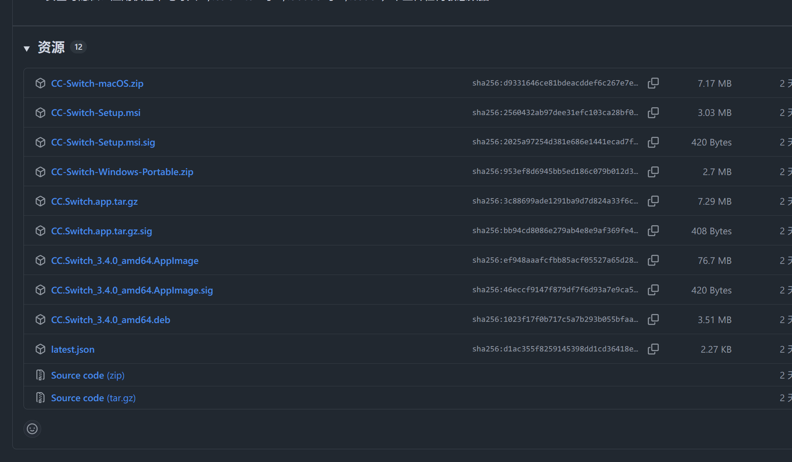
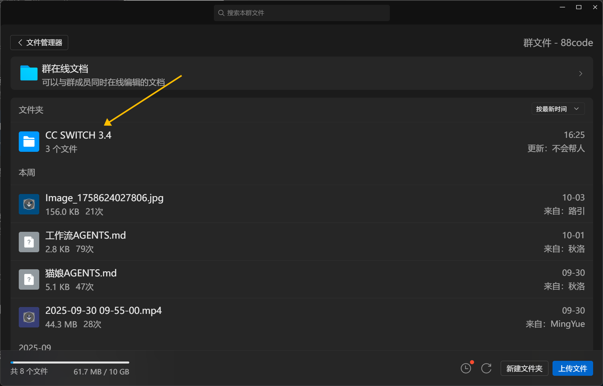
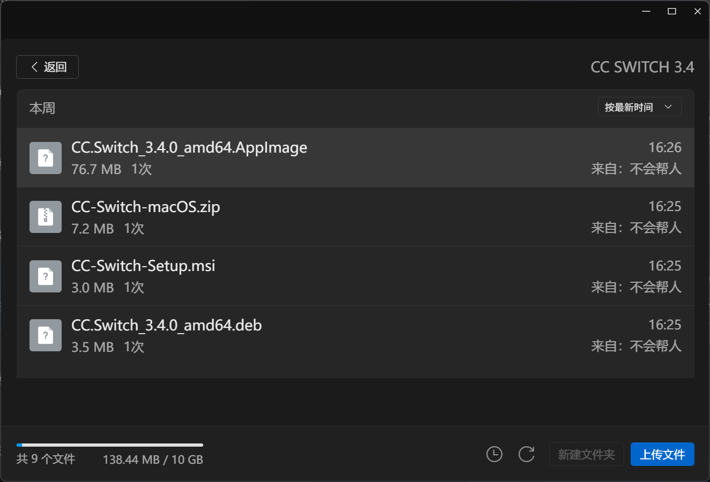
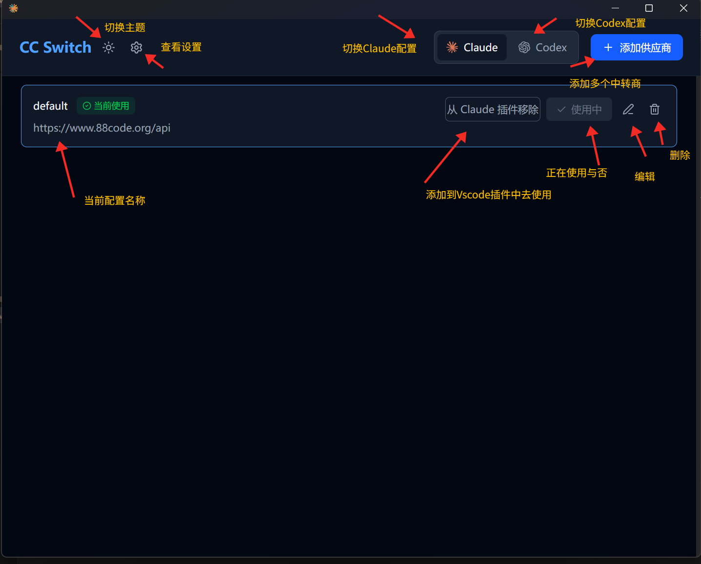
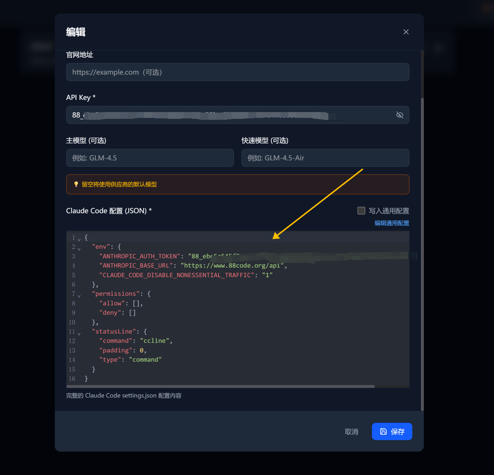
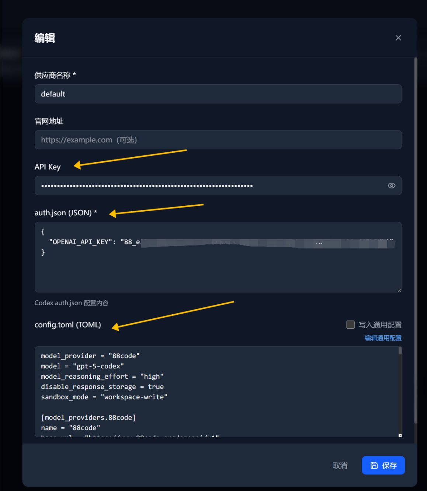
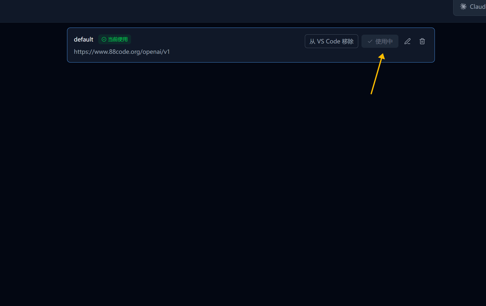
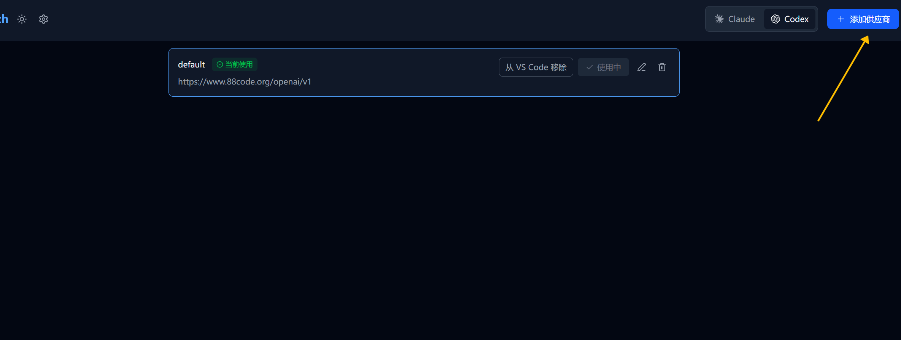
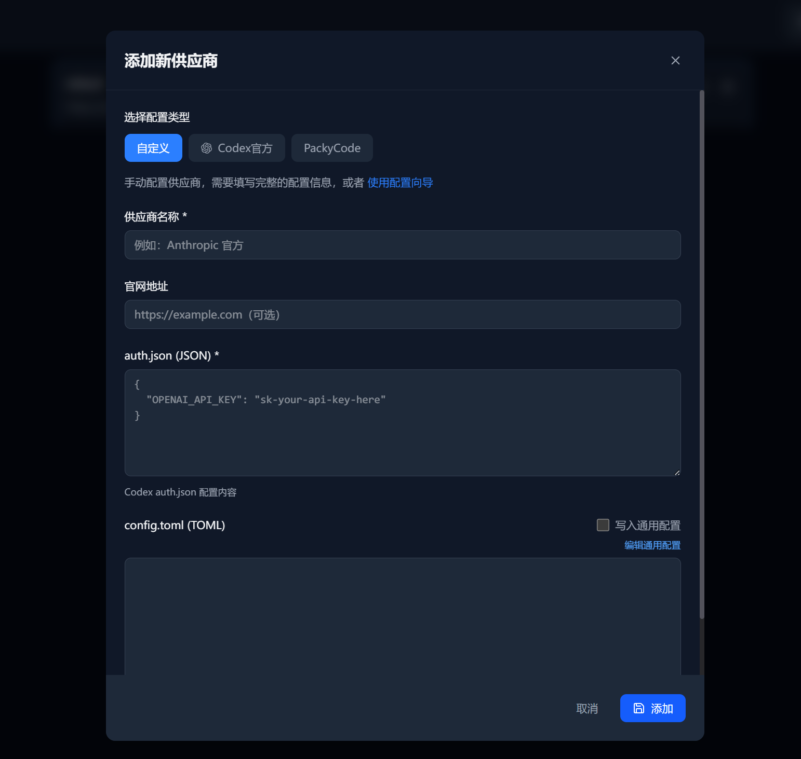
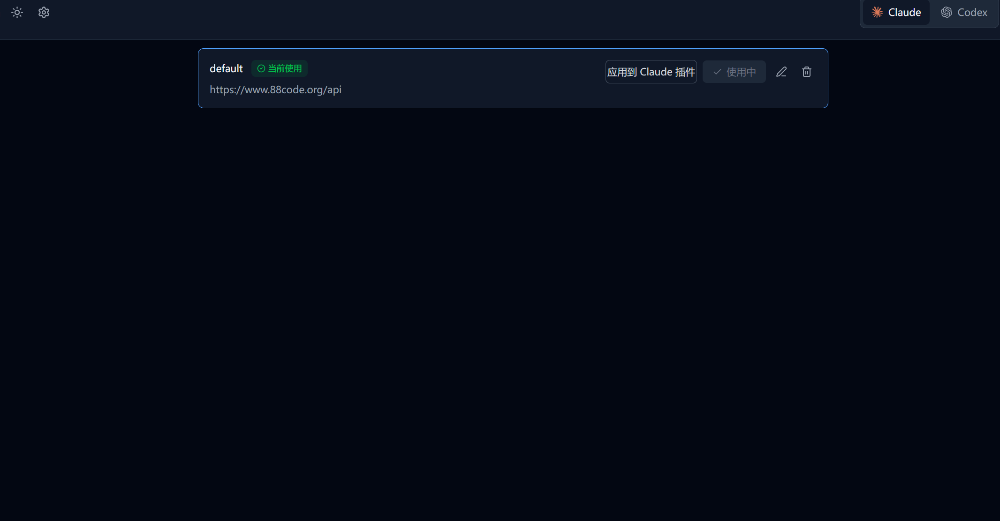

## CC SWITCH使用教程
##### 写作时间: 2025.10.04
大家好呀，国庆快乐!!! 
我是88code的狗管理--，我一直看到大家在群里反复反馈类似授权各种问题,有不少是没有配置好配置文件导致的的，想和大家分享一下CC SWITCH的使用方法。

### 首先介绍一下CC SWITCH是什么?
CC SWITCH是一个用于图形化的Claude Code和Codex多配置文件管理和切换的工具。
它可以帮助用户在不同的配置文件之间快速切换，方便进行多种编程任务。
而且不用再手动打开用户目录去翻配置文件然后打开编辑器编辑，CC SWITCH免除了这个痛苦
只需要在CC SWITCH中选择对应的配置文件即可。

缺点是目前只支持MAC windows 还有Linux这些有桌面环境的操作系统. 无GUI界面的操作系统如服务器和远程服务器等暂不支持.

GitHub repo: https://github.com/farion1231/cc-switch 在此🙏🙏🙏farion1231的付出!!

### 话不多说,我来教大家怎么使用CC SWITCH
#### <font color="red">本教程Windows Mac Linux通用</font>
1. 首先，确保你已经安装了CC SWITCH。可以在88code的下载页面找到它。
打开: https://github.com/farion1231/cc-switch/releases/latest 滑到最后

2. 下载最新版本的CC SWITCH安装包，文件名通常是类似于`CC-Switch-Setup.msi`的格式。
- 如果你是windows用户，点击`CC-Switch-Setup.msi`下载。
- 如果是mac用户，点击`CC-Switch-macOS.zip`下载。
- 如果是Debian或者Ubuntu桌面用户，点击`CC.Switch_3.4.0_amd64.deb`下载。
- 如果是Arch Linux桌面用户，使用`yay cc-switch`命令安装即可。
- 如果是其他Linux桌面用户，点击`CC.Switch_3.4.0_amd64.AppImage`下载。
- 实在不方便的.
也可以在群文件下载安装使用


---
3. 安装完成后
打开cc switch,如图:


4.<font color="red"> 配置Claude Code</font>

点开Claude
在图中箭头处粘贴下方的和88code密钥保存即可
```json
{
  "env": {
    "ANTHROPIC_AUTH_TOKEN": "88_xxx",
    "ANTHROPIC_BASE_URL": "https://www.88code.org/api",
    "CLAUDE_CODE_DISABLE_NONESSENTIAL_TRAFFIC": "1"
  },
  "permissions": {
    "allow": [],
    "deny": []
  }
}
```
<font color="red">务必把88_xxx替换为你自己的88code密钥</font>
5. <font color="red">配置Codex</font>

点开Codex
在图中箭头处依次粘贴88code密钥和下方的配置保存即可
##### auth.json
```json
{
  "OPENAI_API_KEY": "88_xxxx"
}
```
##### config.toml
```toml
model_provider = "88code"
model = "gpt-5-codex"
model_reasoning_effort = "high"
disable_response_storage = true
sandbox_mode = "workspace-write" 
experimental_use_rmcp_client = true
# 内置工具开关
include_plan_tool = true              # 计划/TODO 工具
include_apply_patch_tool = true       # apply_patch 工具（结构化文件编辑）
include_view_image_tool = true        # 视图图像工具（可选）
# 实验性执行相关
experimental_use_freeform_apply_patch = true    # 需要自由格式 apply_patch 时启用（可选）
windows_wsl_setup_acknowledged = true
# 内置 tools 表
[tools]
web_search = true                     # 开启内置 web_search 工具（可选）

[model_providers.88code]
name = "88code"
base_url = "https://www.88code.org/openai/v1"
wire_api = "responses"
env_key = "key88"
requires_openai_auth = true
```
<font color="red">务必把88_xxx替换为你自己的88code密钥</font>

6. 选中自己想用的配置即可,保持其为使用中即可


7. 我有多个key我该怎么用?


按img添加新的供应商即可哦!

8. 我想在VSCode中使用怎么办?
点击图中应用到Claude插件即可,Codex也一样


9. 打完收工!哦耶!
